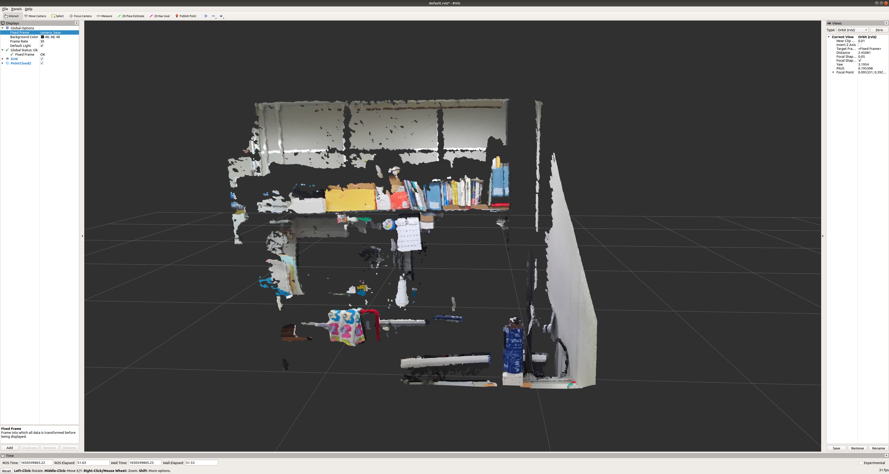
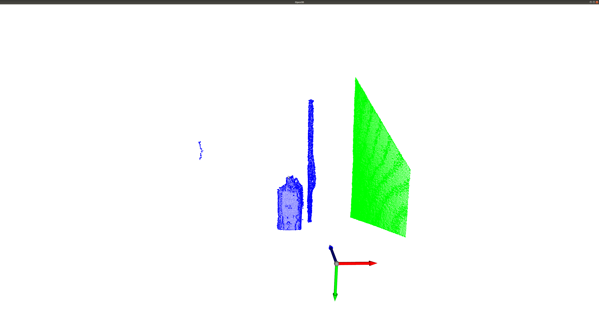

# Point cloud process beginner

This is a Point cloud process examples for the newcomers.

Created by ou.

## Installation
* This code is tested on ubuntu 18.04 and ROS melodic
* Depended on Python 2.7 and Open3D 0.9

## Usage
First, clone this repository to our local environment:
```
$ git clone https://github.com/ou-ais/point_cloud_process_beginner.git
```
Then, play the rosbag file to enable the topic of the point cloud:
```
$ roscore
$ rosbag play -l bagfile.bag
```

After that, you can check the visualization of the point cloud by rviz:
```
$ rviz
```
To view the point cloud, you should press the **Add** button, then **By Topic** and select the '/points2' topics, finally do not forget to change the **fixed frame** to 'camera_base'.

You may see the interface like this:


When you confirmed the topic '/points2' is exist, then you can run the script:
```
$ python Plane_detection.py 1.0 0.01
```
You may get the result of plane detection like this:

The green part represents the plane component in the scene point cloud. (In real world, it is the wall) See the detail of parameters in the code and try to adjust them to observe change of the result.
