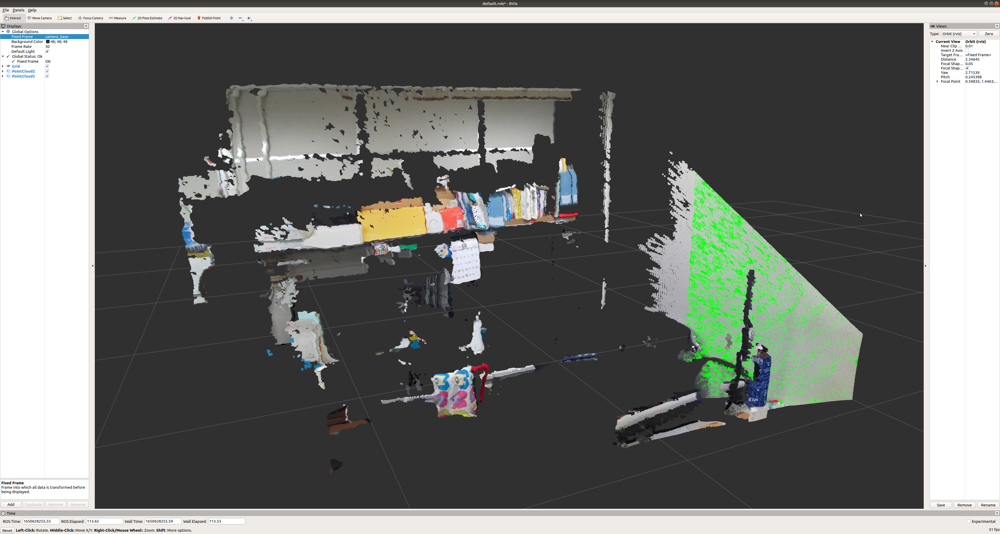

# Point cloud process beginner

This is a Point cloud process examples for the newcomers.

Created by ou.

## Dependence
This code is tested on ubuntu **18.04** and ROS melodic.
* The dependence of in code `open3d_plane_detection.py` are Python **2.7** and Open3D **0.9**.
* For the `pcl_plane_detection` package is **C++** and **PCL**.

## Usage
First, clone this repository to our local environment:
```
$ git clone https://github.com/ou-ais/point_cloud_process_beginner.git
```
Then, play the rosbag file to enable the topic of the point cloud:
```
$ roscore
$ rosbag play -l bagfile.bag
```

After that, you can check the visualization of the point cloud by rviz:
```
$ rviz
```
To view the point cloud, you should press the **Add** button, then **By Topic** and select the '**/points2**' topics, finally do not forget to change the **fixed frame** to 'camera_base'.

You may see the interface like this:


#### Using Open3D
If you use the python with open3d, you can run the script by typing:
```
$ python Plane_detection.py 1.0 0.01
```
You may get the result of plane detection like this:

The green part represents the plane component in the scene point cloud. (In real world, it is the wall) See the detail of parameters in the code and try to adjust them to observe change of the result.

### Using PCL
If you use the c++ with PCL, you should firstly put the `pcl_plane_detection` package in your workspace:
```bash
$ cp -r pcl_plane_detection /your_workspace/src/
$ catkin build pcl_plane_detection
$ source ./devel/setup.bash
$ rosrun pcl_plane_detection pcl_plane_detection 1.5 0.01
```
Then, go back to the rviz, and press **Add** -> **By Topic** -> add the '**/Plane_region**' to the rviz interface.
The result will be like this:

Again, you can adjust the two parameters and see the change of the detection result.